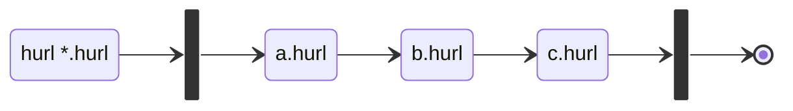
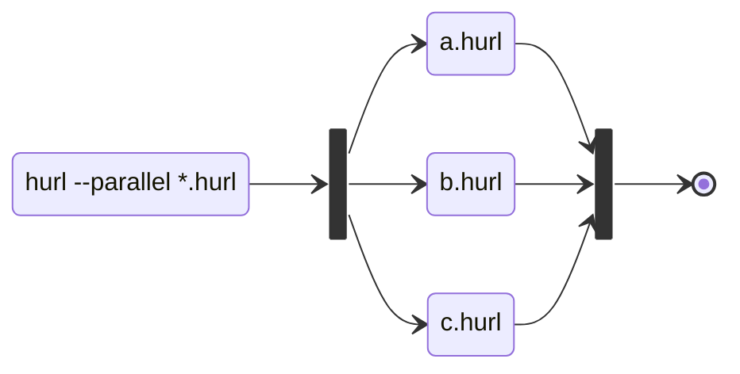

# Parallel Execution Design Document

## Run Execution Diagram

### Default Run



```shell
$ hurl --test a.hurl b.hurl c.hurl
```

### Parallel Run



```shell
$ hurl --parallel --test a.hurl b.hurl c.hurl
```

Reuse `--jobs` option from [GNU Parallel] to specify the number of threads.

```shell
$ hurl --parallel --jobs 4 --test a.hurl b.hurl c.hurl
```

> `--jobs 0` will run as many jobs in parallel as possible.


## State of the Art / Tools

### GNU Parallel

[GNU Parallel] buffers stdout/stderr and postpones the command until the command completes. So the command outputs as soon
as it completes, not necessary in the same order:

```shell
$ parallel echo ::: A B C D
A
C
B
D
$ parallel echo ::: A B C D
B
A
C
D
```

With Hurl:

```shell
$ parallel hurl ::: a.hurl b.hurl c.hurl d.hurl
ABCD%
$ parallel hurl ::: a.hurl b.hurl c.hurl d.hurl
BACD%
```

> The last test has been executed with the Flask instance. If we block in the /a endpoint, we have the direct response
> from /b, /c, /d and then /a. By default, Flask can handle concurrent requests with thread.

Regarding stderr, we can see that stdout is flush, then stderr. In the next test, we have the response before the stderr:


```shell
$ parallel hurl --verbose ::: a.hurl b.hurl c.hurl d.hurl
A* ------------------------------------------------------------------------------
* Executing entry 1
*
* Cookie store:
*
* Request:
* GET http://localhost:8000/a
*
...
< Connection: close
<
*
B* ------------------------------------------------------------------------------
* Executing entry 1
*
* Cookie store:
*
* Request:
* GET http://localhost:8000/b
*
...
< Connection: close
<
*
C* ------------------------------------------------------------------------------
* Executing entry 1
*
* Cookie store:
*
* Request:
* GET http://localhost:8000/c
*
...
< Connection: close
<
*
D* ------------------------------------------------------------------------------
* Executing entry 1
*
* Cookie store:
*
* Request:
* GET http://localhost:8000/d
*
...
< Connection: close
<
*
```

#### Interesting option

- `--tag`: add the parameter value before each call:

```shell
$ parallel --tag echo ::: A B C D
A	A
B	B
C	C
D	D
```

```shell
$ parallel --tag hurl ::: a.hurl b.hurl c.hurl d.hurl
a.hurl	Ab.hurl	Bc.hurl	Cd.hurl	D%
```

The tag value is configurable.

- `keep-order/-k`: force GNU Parallel to print in the order of values, the commands are still run in parallel.

```shell
$ parallel sleep {}';' echo {} done ::: 5 4 3 2 1
1 done
2 done
3 done
4 done
5 done
```

#### From Hurl issues/discussions:

From [#87]():

```shell
$ parallel -j $(ls -1 *.hurl | wc -l) -i sh -c "hurl {} --test" -- *.hurl
$ echo "retval: $?"
```

### wrk2

[wrk2](https://github.com/giltene/wrk2), a HTTP benchmarking tool based mostly on wrk.

## --test Output

Demo here => <https://jcamiel.github.io/parallel/>

### Hurl 4.2.0 sync run

```shell
$ hurl --test *.hurl
/tmp/foo/bar/baz/job-1.hurl: Running [1/10]
/tmp/foo/bar/baz/job-1.hurl: Success (10 request(s) in 10096 ms)
/tmp/foo/bar/job-2.hurl: Running [2/10]
/tmp/foo/bar/job-2.hurl: Success (2 request(s) in 3019 ms)
/tmp/foo/bar/zzzzzz/job-3.hurl: Running [3/10]
 [========>               ] 2/3
```

### Hurl 4.2.0 parallel 5 jobs / option 2

- Progress bar on the right
- Idle jobs are displayed

```shell
$ hurl --test --parallel *.hurl
/tmp/foo/bar/job-2.hurl: Success (2 request(s) in x ms)
/tmp/foo/bar/job-6.hurl: Success (4 request(s) in x ms)
/tmp/foo/bar/job-4.hurl: Success (7 request(s) in x ms)
#1 /tmp/foo/bar/baz/job-1.hurl: Running [1/10] [============>           ] 6/10
#2 /tmp/foo/bar/ee/job-7.hurl: Running [7/10] [>                       ] 1/1
#3 /tmp/foo/bar/zzzzzz/job-3.hurl: Running [3/10] [================>       ] 3/3
#4 /tmp/foo/bar/fff/job-8.hurl: Running [8/10] [>                       ] 1/5
#5 /tmp/foo/bar/ddd/job-5.hurl: Running [5/10] [================>       ] 9/12
```

```shell
/tmp/foo/bar/job-2.hurl: Success (2 request(s) in x ms)
/tmp/foo/bar/job-4.hurl: Success (7 request(s) in x ms)
/tmp/foo/bar/job-6.hurl: Success (4 request(s) in x ms)
/tmp/foo/bar/zzzzzz/job-3.hurl: Success (3 request(s) in x ms)
/tmp/foo/bar/ddd/job-5.hurl: Success (12 request(s) in x ms)
/tmp/foo/bar/ee/job-7.hurl: Success (1 request(s) in x ms)
/tmp/foo/bar/baz/job-1.hurl: Success (10 request(s) in x ms)
#1 -: Idle
#2 /tmp/foo/bar/fff/job-8.hurl: Running [8/10] [===================>    ] 5/5
#3 /tmp/foo/bar/job-9.hurl: Running [9/10] [===================>    ] 9/10
#4 -: Idle
#5 /tmp/foo/bar/job-10.hurl: Running [10/10] [================>       ] 3/3
```

### Hurl 4.2.0 parallel 5 jobs / option 2

- Progress bar on the left
- Idle jobs are not displayed

```shell
/tmp/foo/bar/job-2.hurl: Success (2 request(s) in x ms)
/tmp/foo/bar/job-6.hurl: Success (4 request(s) in x ms)
/tmp/foo/bar/job-4.hurl: Success (7 request(s) in x ms)
#1 [============>           ] 6/10 /tmp/foo/bar/baz/job-1.hurl: Running [1/10]
#2 [>                       ] 1/1 /tmp/foo/bar/ee/job-7.hurl: Running [7/10]
#3 [================>       ] 3/3 /tmp/foo/bar/zzzzzz/job-3.hurl: Running [3/10]
#4 [>                       ] 1/5 /tmp/foo/bar/fff/job-8.hurl: Running [8/10]
#5 [================>       ] 9/12 /tmp/foo/bar/ddd/job-5.hurl: Running [5/10]
```


## How to Test

Flask `run` method [takes a `threaded` option] to handle concurrent requests using thread or not (`True` by default).  


## Related Issues 

[1139 - how can send bulk request](https://github.com/Orange-OpenSource/hurl/issues/1139)

[88 - add the --concurrency option to launch multiple runs of *.hurl files instead of one](https://github.com/Orange-OpenSource/hurl/issues/88)

[87 - add the --parallel option to run *.hurl files in parallel instead of sequentially](https://github.com/Orange-OpenSource/hurl/issues/87)

## Related Options

- `--repeat` TBD
- `--repeat-all` TBD
- ...

## Console Output

[Console output should better reflect the build process](https://github.com/rust-lang/cargo/issues/8889)


TODO: make asciinema for different options. 


## Backlog

- What options do we expose?
- Visualization? How do we report the timelines of Hurl files execution
- How to test? Support // in Flask?
- stderr / verbose report: do we prefix log lines by thread id / index ? We could make the debug logs identical whether
files are run sequentially or run in parallel.
- Does the user set "thread" affinity in Hurl files? (see https://github.com/Orange-OpenSource/hurl/issues/88#issuecomment-1674518247)
- What's the Rust runner API? Actually, we only expose on public method to run an Hurl file, we need(?) to expose methods
to runs multiple files


[takes a `threaded` option]: https://werkzeug.palletsprojects.com/en/3.0.x/serving/#werkzeug.serving.run_simple
[GNU Parallel]: https://www.gnu.org/software/parallel/

