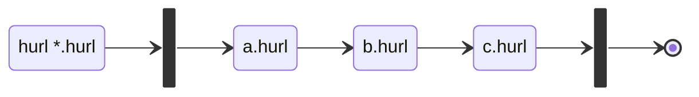
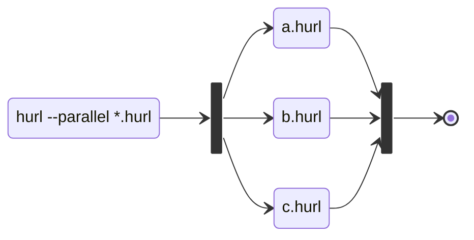

# Supporting Parallel Execution of Hurl Files

## Usage

### Default Run



### Parallel Run




## Related Issues 

[1139 - how can send bulk request](https://github.com/Orange-OpenSource/hurl/issues/1139)

[88 - add the --concurrency option to launch multiple runs of *.hurl files instead of one](https://github.com/Orange-OpenSource/hurl/issues/88)

[87 - add the --parallel option to run *.hurl files in parallel instead of sequentially](https://github.com/Orange-OpenSource/hurl/issues/87)

## Related Options

- `--repeat` TBD
- `--repeat-all` TBD
- ...

## Console Output

We need to defined what will be the output on stdout/stderr when running in parallel. We can take inspiration of 
example of parallel execution from cargo issue [Console output should better reflect the build process](https://github.com/rust-lang/cargo/issues/8889)


TODO: make asciinema for different options. 


## Tools 

### wrk2 

[wrk2](https://github.com/giltene/wrk2), a HTTP benchmarking tool based mostly on wrk.

### GNU parallel

[GNU parallel](https://www.gnu.org/software/parallel/)

From [#87]():

```shell
$ parallel -j $(ls -1 *.hurl | wc -l) -i sh -c "hurl {} --test" -- *.hurl
$ echo "retval: $?"
```

## Backlog

- What options do we expose?
- Visualization? How do we report the timelines of Hurl files execution
- How to test? Support // in Flask?
- stderr / verbose report: do we prefix log lines by thread id / index ? We could make the debug logs identical whether
files are run sequentially or run in parallel.
- Does the user set "thread" affinity in Hurl files? (see https://github.com/Orange-OpenSource/hurl/issues/88#issuecomment-1674518247)
- What's the Rust runner API? Actually, we only expose on public method to run an Hurl file, we need(?) to expose methods
to runs multiple files


