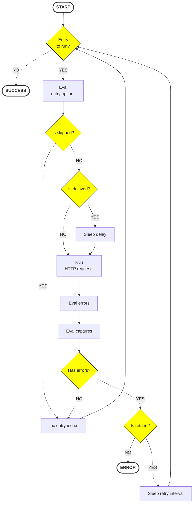

# Entry Run Cycle

The run cycle of an entry: explanation of `skip`, `delay`, `retry`, when captures and errors are computed etc...

This is the current run loop.

```mermaid
flowchart TB
    start(["`**START**`"])
    succeed(["`**SUCCESS**`"])
    error(["`**ERROR**`"])
    has_entry{Entry\nto run?}
    options[Eval\nentry options]
    is_skip{Is skipped?}
    inc_entry[Inc entry index]
    is_delay{Is delayed?}
    sleep_delay[Sleep delay]
    run_http[Run\nHTTP requests]
    eval_errors[Eval errors]
    eval_captures[Eval captures]
    has_errors{Has errors?}
    is_retry{Is retried?}
    retry_interval[Sleep retry interval]

    start --> has_entry
    has_entry -. YES .-> options
    has_entry -. NO .-> succeed 
    options --> is_skip
    is_skip -. YES .-> inc_entry
    is_skip -. NO .-> is_delay 
    inc_entry --> has_entry
    is_delay -. YES .-> sleep_delay
    is_delay -. NO .-> run_http
    sleep_delay --> run_http
    run_http --> eval_errors
    eval_errors --> eval_captures
    eval_captures --> has_errors
    has_errors -. YES .-> is_retry
    has_errors -. NO .-> inc_entry
    is_retry -. YES ..-> retry_interval
    is_retry -. NO .-> error
    retry_interval --> has_entry


    style start fill:none,stroke:#333,stroke-width:3px
    style succeed fill:none,stroke:#333,stroke-width:3px
    style error fill:none,stroke:#333,stroke-width:3px
    style has_entry fill:yellow,stroke:black
    style is_skip fill:yellow,stroke:black
    style is_delay fill:yellow,stroke:black
    style has_errors fill:yellow,stroke:black
    style is_retry fill:yellow,stroke:black
```

